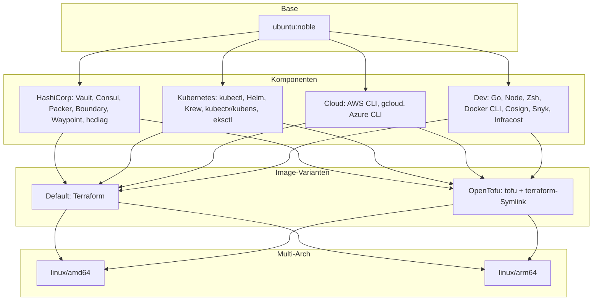

# Architektur

## Base-Image und Plattformen

- **Base:** `ubuntu:noble` (Ubuntu 24.04 LTS)
- **Multi-Arch:** Images werden für **linux/amd64** und **linux/arm64** gebaut (Build-Arg `TARGETARCH`). Alle Binaries (Go, HashiCorp, kubectl, Helm, AWS CLI, Cosign, …) werden architekturabhängig aus den offiziellen Quellen geladen.

## Komponenten

Das Image baut auf vier inhaltlichen Säulen auf:

| Kategorie | Beispiele |
|-----------|-----------|
| **HashiCorp** | Terraform (oder OpenTofu), Vault, Consul, Packer, Boundary, Waypoint, hcdiag |
| **Kubernetes** | kubectl, Helm, Krew, kubectx/kubens, eksctl |
| **Cloud-CLIs** | AWS CLI v2, gcloud, Azure CLI; Session Manager Plugin, aws-iam-authenticator |
| **Dev & Shell** | Go, Node.js/npm, Python/pip/pipx, Docker CLI & Compose, Zsh (oh-my-zsh, powerlevel10k), PostgreSQL-Client, Redis-Cli, jq, httpie, Cosign, Snyk, Infracost |

Weitere Details und Versionen stehen im [Dockerfile](../Dockerfile) bzw. [Dockerfile.opentofu](../Dockerfile.opentofu).

## Image-Varianten

Es gibt zwei Varianten, die sich nur in der IaC-Engine unterscheiden:

- **Default (Terraform):** Enthält Terraform von HashiCorp. Dockerfile: [Dockerfile](../Dockerfile). Tag-Suffix: `latest` bzw. `vX.Y.Z`.
- **OpenTofu:** Enthält OpenTofu (`tofu`); zusätzlich existiert ein Symlink `terraform` → `tofu`. Dockerfile: [Dockerfile.opentofu](../Dockerfile.opentofu). Tag-Suffix: `latest-opentofu` bzw. `vX.Y.Z-opentofu`.

Beide Images teilen dieselbe Basis und denselben übrigen Tool-Stack (Vault, Consul, K8s, Cloud-CLIs, Zsh, …).

## Architektur-Grafik

- **Base** ist das Ubuntu-Image.
- **Komponenten** sind die vier Tool-Gruppen, die in beiden Varianten verbaut werden.
- **Varianten** sind die beiden Images (Terraform vs. OpenTofu).
- **Multi-Arch:** Beide Varianten werden für amd64 und arm64 gebaut und nach GHCR gepusht.
