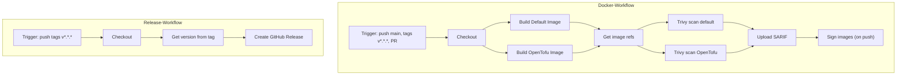

# Pipelines

Zwei GitHub-Actions-Workflows steuern Build, Sicherheits-Scan, Signing und Releases.

## Docker-Workflow (Build, Trivy, Signing)

**Datei:** [.github/workflows/docker-publish.yml](../.github/workflows/docker-publish.yml)

**Trigger:**

- Push auf Branch `main`
- Push von Tags `v*.*.*` (z. B. `v1.0.0`)
- Pull Requests gegen `main`

**Ablauf:**

1. **Checkout** des Repositories
2. **Cosign** (nur bei Push, nicht bei PR): Installation für späteres Signieren
3. **Docker Buildx** einrichten
4. **Registry-Login** (nur bei Push): GHCR (`ghcr.io`)
5. **Metadata:** Zwei Aufrufe von `docker/metadata-action` – einmal für das Default-Image, einmal für die OpenTofu-Variante (Tag-Suffix `-opentofu`)
6. **Build:** Zwei Images werden gebaut:
   - Default aus [Dockerfile](../Dockerfile) (Terraform)
   - OpenTofu aus [Dockerfile.opentofu](../Dockerfile.opentofu)
   - **Bei PR:** Nur `linux/amd64`, Image wird geladen (`load: true`), nicht gepusht
   - **Bei Push:** `linux/amd64` und `linux/arm64`, Push nach GHCR
7. **Image-Refs:** Erste Tag-Zeile pro Image wird ausgeben (für Trivy)
8. **Trivy:** Beide Images werden mit Trivy gescannt (nur `vuln`-Scanner). SARIF wird erzeugt; der Job schlägt nicht mehr bei Findings fehl (`exit-code: 0`). Findings erscheinen unter **Security → Code scanning**.
9. **SARIF-Upload:** Beide SARIF-Dateien werden an GitHub Code Scanning hochgeladen (falls vorhanden)
10. **Signing** (nur bei Push): Beide Images werden mit Cosign (Sigstore) signiert; Rekor-Transparenzlog bei öffentlichen Repos

## Release-Workflow

**Datei:** [.github/workflows/release.yml](../.github/workflows/release.yml)

**Trigger:** Nur Push von Tags `v*.*.*`

**Ablauf:**

1. **Checkout** mit voller History (`fetch-depth: 0`) für Release Notes
2. **Version** aus dem Tag auslesen (z. B. `v1.0.0`)
3. **GitHub Release** anlegen mit `softprops/action-gh-release`:
   - Name und Tag = Version
   - `generate_release_notes: true` (Commits seit letztem Tag)
   - Body: Tabelle der Container-Images (Default + OpenTofu), Pull/Run- und Cosign-Verify-Befehle für diese Version

Die Docker-Images für diese Version werden parallel vom Docker-Workflow gebaut und gepusht; das Release verweist nur auf die Tags.

## Pipeline-Grafik

- **Docker-Workflow:** Trigger → Checkout → beide Builds → Image-Refs → Trivy für beide Images → SARIF-Upload → bei Push Signing.
- **Release-Workflow:** Tag-Push → Checkout → Version auslesen → GitHub Release mit Notizen und Image-Body erstellen.
